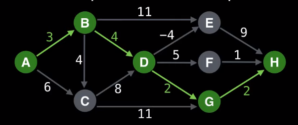

<!-- 
Playlist status

11
12
13
14

18
19

21
22

24
25
26
27
28
29

33
34
35
36
37
38
39
40
41
42
43
 -->

<p align="center">
	<b>Stack</b>
</p>
<p align="center">
	
</p>

<p align="center">
	<b>Queue</b>
</p>
<p align="center">
	
</p>

Content:
    - Description
    - Illustration
    - Complexity
    - PseudoCode

# Trees

<p align="center">
	<b>Tree</b>
</p>
<p align="center">
	
</p>

```python
A tree is an undirected graph with no cycle.
A connected graph with N nodes and N - 1 edges.

```

<p align="center">
	<b>Rooting a Tree</b>
</p>
<p align="center">
	
</p>

```python
Rooted Tree => A tree with a designated root node with preferred directional edges.
```

**Storage methods**

```python
Edge list
    List of undirected edges indicating which two nodes have an between them.

Adjacency List
    Mapping of a node to all its neighbors

Adjacency Matrix

Flattened array => preferred for binary trees
    Where each node is assigned an index and the values are stored in an array with the indexes.

Trees can be non-directional as well.
```

## Binary Trees

<p align="center">
	<b>Binary Tree</b>
</p>
<p align="center">
	
</p>

```python
Every Nodes has at most two child nodes.

Leaf Node => Lowest node with the tree  (Node with no children)

Height => Number of edges from the root node of leaf node.

Parent of root node is NIL

DataType: Set based Collection

Abilities:
    insert
    delete
    find
    traversal
        map
        iter

Each node has a key (value of node) associated so that it can be referenced and can be used for comparison.

Successor of a node N:
    The node with the smallest key greater than N's key.
    i.e move one step to right and then all the way to leftmost leaf.

```

<p align="center">
	<b>Binary Search Tree</b>
</p>
<p align="center">
	
</p>

```python

Binary Search Tree => an variant of BT where the value of left node is less than 
and value of right node is greater than the value of current node.

Bad BST => when height of tree is same as number of nodes

    1
     \
      2
       \
        3
         .
          .
           n
       
Good BST => A well balanced tree, where height is equal to log_2(nodes)


		     7
		   /   \
		  4     10
		 / \   /  \
		2   5 9   12

```

### Traversal

Can be performed iteratively or recursively. Iterative approach uses stack to store the node to be visited.

**Depth First Search(preferred)**

```python
Easily implemented recursively
```

```python
Inorder
    Traverse the left subtree
    Visit the parent
    Traverse the right subtree

Preorder
    Visit parent
    Traverse the left subtree
    Traverse the right subtree

Postorder
    Traverse the left subtree
    Traverse the right subtree
    Visit parent

BST when traversed in an inorder manner return a sorted array.
    Can be used to verify the validity of the tree.
```

**Breadth First Search**

```python
Traverse all the nodes of a lower level before moving to any of the nodes of a higher level.
```

```python
Naive approach
    Find height of tree. Then for each level, run a recursive function by maintaining current height. 
    Whenever the level of a node matches, use that node.

Queue
    Push the nodes of a lower level in the queue. When any node is visited, 
    pop that node from the queue and push the child of that node in the queue.

    Useful to find the height of the tree.
```

### Common Tree Problems

**Lowest Common Ancestor**

```python
check whether the nodes p and q are in the left and right subtrees of the current node,
and if so, returns the current node as the lowest common ancestor. Otherwise, 
it recursively searches in either the left or right subtree based on the presence of nodes p and q.

Pseudocode:

function lowestCommonAncestor(root, p, q):
    if root is None:
        return None
    
    # If either p or q matches the root value, it is the LCA
    if root == p or root == q:
        return root
    
    # Recur for left and right subtrees
    left_lca = lowestCommonAncestor(root.left, p, q)
    right_lca = lowestCommonAncestor(root.right, p, q)
    
    # If both nodes are found in the left and right subtrees, then the current node is the LCA
    if left_lca and right_lca:
        return root
    
    # Otherwise, return the non-None node (either left_lca or right_lca)
    return left_lca if left_lca else right_lca

```
**Binary Tree From Preorder**

**Recovery of Binary Tree**

**Rooting a Tree**

### Operations

**Validity**
```python
A tree is binary search tree or not can checked by utilizing the property that inorder traversal
 generates a sorted list. If it is not then three is not a valid BST
```
**Height**
```python
The height of the tree can figured out by measuring the levels of traversal in BFS.
```

**Insert**
```python
Insertion can be performed by utilizing DFS and attaching a new node at the appropriate leaf node.
```

**Delete**
```python
For deletion different cases needs to considered.
    Node with no children (Leaf node): Simply remove the node.
    Node with one child: Replace the node with its child.
    Node with two children: Find the node's in-order successor (smallest node in its right subtree), 
    copy the successor's value to the node, and then delete the successor.
```

## Self Balancing Trees

```python
Trees which optimize their structure so that the height of the tree is as low as possible.
```

### Red-Black Trees

BST + "stuff"

```python
Every node has color, red or black (single bit data) associated

Rules:
    The root and leaves are colored black.
    Every red node must have 2 black children.
    ❗ The number of black nodes on any path from any node to its leaf must be same.

Example: ○ - black, ● - red

           ○
       /        \
      ●          ○
   /     \        \
  ○       ○        ●
 / \    /   \     / \
○   ○  ●     ●   ○   ○
      / \   / \  
     ○   ○ ○   ○   

Height of a red-black tree (h)
log_2(n) < h < 2(log_2(n)) , where n is number of nodes
```

[Treaps](https://www.youtube.com/watch?v=d0rlrRZc-0s)

## Skip List

Alternative to balance trees.
Randomized data structure uses probability.

```python
A combination of list stacked on top of each other where bottom list contains all the element 
as we go up of the list only the important elements are kept and others are skipped.

Each layer is a subset of layer below.
Bottom layer contains all the elements.
Each layer is sorted
And two pointers are used, right  - indicating to next element in same layer.
                           bottom - indicating to same element in the below layer.

Start from top left elements go right until required element is greater that current element
Move down if next element is greater that required element, repeat the process.

When a element is to be inserted it is first added in the bottom most layer then a coin is tossed
to decide whether the node is to be added in the top layer or not, making it a probabilistic data structure. 
```

---

# Graphs

<p align="center">
	<b>Undirected graphs</b>
</p>

```python
Edges have no orientation (direction)
```


<p align="center">
	
</p>


<p align="center">
	<b>Directed graphs</b>
</p>

```python
Edges have orientation (direction). Traversal happens in the indicated direction only and not the other way around.
```


<p align="center">
	
</p>

<p align="center">
	<b>Weighted Graphs</b>
</p>


```python
Where edges have weights associated which connects nodes.
```


<p align="center">
	
</p>

<p align="center">
	<b>Directed Acyclic graphs</b>
</p>


```python
Directed graphs with no cycles.
```


<p align="center">
	
</p>

**Storage methods**
```python
- Adjacency 2D matrix.
- Adjacency Lists.
- Edge list.
```

Reverse of a graph is a graph where the direction all the directed edges are reversed. 
If a graph is denoted by Adjacency 2D matrix the reverse of it is simply the transpose of the matrix. 

## Traversal

**Depth First Search**

```python
Plunges depth first into into a graph without regard for which edge it take next
until it cannot go further at which point it backtracks and continues.

We do not revisit a node. This happens in case of cycle, so
So we backtrack to the cycle origin and continue.

Usage:
    - Used to find number of components within a graph by assigning ids to each group.
    - Compute a graphs minimum spanning tree
    - Detect and find cycles
    - Check if a graph is a bipartite
    - Find strongly connected components.
    - Topologically sort the nodes of a graph.
    - Find bridges and articulation points.
    - Find augmented paths in a flow network.
    - Generate mazes.

Utilizes recursive method to traverse the neighbor node of the current node.

PseudoCode:

# Global or class scope variables n = number of nodes in the graph
g = adjacency list representing graph visited = [false, ..., false] # size n
function dfs(at):
    if visited[at]: return 
    visited[at] = true
    
    neighbours = graph[at]
    for next in neighbours: 
        dfs (next)

# Start DFS at node zero start_node = 0
dfs(start_node)


```

```python
Complexity: O(V+E)
```

[Visualization](https://www.youtube.com/watch?v=NUgMa5coCoE)


**Breadth First Search**

```python
Explores the neighbor nodes first, before moving to the next level of neighbors.
Utilizes queue to store the node yet to be visited.

usage:
    - Shortest path on unweighted graphs.

Utilizes queue to store the next node should be visited next.

PseudoCode:
# Global/class scope variables 
n = number of nodes in the graph
g = adjacency list representing unweighted graph

# s = start node, e = end node, and 0 ≤e,s< n 
function bfs(s, e):
    # Do a BFS starting at node s
    prev = solve(s)

    # Return reconstructed path from s -> e 
    return reconstructPath(s, e, prev)

function solve(s):
    q = queue data structure with enqueue and dequeue 
    q.enqueue(s)

    visited = [false, ..., false] # size n 
    visited [s] = true

    prev = [null, ..., null] # size n 
    while !q.isEmpty():
        node = q.dequeue()
        neighbours g.get(node)
    
    for (next : neighbours):
        if !visited [next]:
            q.enqueue(next)
            visited [next] = true 
            prev [next] = node
return prev

```

```python
Complexity: O(V+E)
```

[Visualization](https://www.youtube.com/watch?v=x-VTfcmrLEQ)

One of the traversal aspect is the discovery and finish time.
Discovery time is the time stamp from the start of the traversal when the node is marked visited and finish time is the time stamp where the there are no more neighbors of the node and the is never going to be visited.
Each jump from a node to another results in increment in time.

## Common Graph Theory Problems

```python
Askable questions:
- Is the graph directed or undirected?
- Are the edges of the graph weighted?
- Is  the graph dense with edges?
- What data structure should I use for representation of matrix?
```

```python
Shortest path from Node A to Node B. in a weighted graph.
- Algos: BFS (unw
eighted graph), Dijkstra's, Bellman-Ford, A* 

Connectivity between two Node
- Solution: Search operation.

Negative cycles
- Algos: Bellman-Ford, Floyd-Warshall

Strongly Connected Components
- Algos: Tarjans' and Kosaraju's

**Traveling Sales Person**
- Algos: Held-Karp, branch and bound.

Bridges

Minimal Spanning Trees
- Algos: Krushal's, Prims's, 

Network Flow
- Algos: Ford-Fulkerson.

Identification of cycles
```
**BFS on Grids**

```python
A grid can be easily converted to a Adjacency list.
    - LAbel each cell with numbers, each cell denotes a node.
    - Neighboring cells are ones connected up, down, left and right

A grid if represented using a 2D matrix (x,y) in that senario we do not need to
generate a Adjacency list, adjacent elements are can evaluated by adding a direction vector.
and then checking if the generated cell is a valid cell or not.
If it is enqueue it for next iteration and mark it as visited.

If the path is to be drawn from start to end we need to store 
the previously visited node for each current node.

PseudoCode:

# Global/class scope variables
R, C = ... # R = number of rows, C = number of columns 
m = ... # Input character matrix of size Rx C
sr, sc = ... # 'S' symbol row and column values
rq, cq = ... # Empty Row Queue (RQ) and Column Queue (CQ)

# Variables used to track the number of steps taken. 
move_count = 0
nodes_left_in_layer = 1 
nodes_in_next_layer = 0

# Variable used to track whether the 'E' character # ever gets reached during the BFS. 
reached_end = false

# R x C matrix of false values used to track whether # the node at position (i, j) has been visited. 
visited = ...

# North, south, east, west direction vectors. dr [-1, +1, 0, 0]
dc = [0, 0, +1, -1]


function solve(): 
    rq.enqueue(sr) 
    cq.enqueue(sc)
    visited [sr][sc] = true
    while rq.size() > 0: # or cq.size() > 0 
        r = rq.dequeue()
        c = cq.dequeue()
        if m[r][c] == 'E':
            reached_end = true
            break
        explore_neighbours (r, c) 
        nodes_left_in_layer--
        if nodes_left_in_layer == 0:
            nodes_left_in_layer = nodes_in_next_layer
            nodes_in_next_layer = 0
            move_count++
    if reached_end:
    return move_count
return -1

```

**Topological Sort**

<p align="center">
	
</p>

```python
A topological ordering is an ordering of the nodes in a directed edge from node A to B, 
where node A appears before node B in the ordering.

Topological ordering are NOT unique. 

A graph with cycle cannot have a valid ordering.
Only Directed Acyclic Graphs have valid topological ordering.
How to find if a graph contains cycle or not?
    Tarjan's strongly connected components.

All trees have topological ordering which is the BFS traversal of the tree.

Using DFS:
    Pick an unvisited node.
    Beginning with the selected node, da a DFS exploring only unvisited nodes.
    On recursive callback of DFS, add the current node to the topological ordering in reverse order.

    PseudoCode:
    # Global or class scope variables 
    n = number of nodes in the graph 
    g = adjacency list representing graph 
    count = 0
    components = empty integer array # size n 
    visited = [false, ..., false] # size n
    
    function find Components(): 
        for (i = 0; i < n; i++): 
            if !visited[i]:
                count++ 
                dfs(i)
        return (count, components)

        function dfs(at):
            visited [at] = true 
            components [at] = count 
            for (next g[at]): 
                if !visited [next]: 
                    dfs(next)

Kahn's Algorithm
    Detects if a graphs contains a cycle or not. 

    Repeatedly remove nodes without any dependencies from the graph and add them to the topological ordering.
    As nodes without dependencies (and their outgoing edges) are removed from the graph, 
    new nodes without dependencies should become free.
    We repeat removing nodes without dependencies from the graph until all nodes are processed, 
    or a cycle is discovered. 

    Dependencies can be found out from the Adjacency list or matrix.

    PseudoCode:

    #`g` is a directed acyclic graph represented as an adjacency list. 
    function FindTopologicalOrdering (g):
        n = g.size()
        in_degree = [0,0,..,0,0] # size n
        for (i = 0; i < n; i++):
            for (to in g[i]):
                in_degree[to] = in_degree [to] + 1

        #`q always contains the set nodes with no incoming edges. 
        q=...# empty integer queue data structure
        for (i = 0; i < n; i++):
            if (in_degree[i] == 0): 
                q.enqueue(i)

        index = 0
        order [0,0,0,0] # size n
        while (!q.isEmpty()):
            at q.dequeue()
            order [index++] = at
            for (to in g[at]):
                in_degree[to] = in_degree[to] – 1 
                if in degree [to] == 0:
                    q.enqueue(to)
        if index != n:
            return null # Oops, graph contains a cycle
        return order

```

```python
Complexity: O(V+E)
```

**Strongly connected components (SCC)**

<p align="center">
	
</p>

```python
Strongly connected components can thought of as self-contained cycles within a directed graph where
every vertex in a given cycle can reach every other vertex of the same cycle. 
More or else it is a group of nodes within the graph where each node can be reached from every other node.

Low-Link Value:
    The low-link value of a node is the smallest (lowest) node id reachable from that node when doing a DFS (including itself)
When assigned low link values to the nodes traversed in DFS in turns out 
to be that all strongly connected components have same low link value.
But this depends on the start node of DFS which is random.

This is where tarjan's algo come in handy.

Tarjan's Algorithm:
    Mark the id of each node as unvisited.
    Start DFS. Upon visiting a node assign it an id and a low-link value. 
        Also mark current nodes as visited and add them to a seen stack.
    On DFS callback if the prev node is on stack then min the current node's low link value with the last node's low link value. 
        (This allows low link values to propagate through cycles)
    After visiting all neighbors, if the current node started a connected component
        (a node starts a connected component if its id is equal to its low link value) 
            then pop nodes off stack until current node is reached.

    PseudoCode:

    UNVISITED = −1
    n = number of nodes in graph
    g = adjacency list with directed edges

    id = 0    # Used to give each node an id 
    sccCount = 0 # Used to count number of SCCs found
    
    # Index i in these arrays represents node i
    ids = [0, 0, ... 0,0]     # Length n
    low = [0, 0, ... 0,0]     # Length n

    onStack = [false, false, ...,false] # Length n 
    stack an empty stack data structure

    function findSccs():
        for(i = 0; i < n; i++): ids[i] = UNVISITED
        for(i = 0; i < n; i++):
            if(ids [i] ==  UNVISITED):
                dfs(i)
    return low`


Maximal strongly connected components are ones which cannot be extended into SCC by adding other nodes.
Properties:
    Intersection of all MSCC is a null set.
    If we combine all SCC into a single node then the super-graph generated is a directed acyclic graph

SCC can also be figured out by performing DFS on the reverse graph and generating a list of completed cycles.

```

```python
Complexity: linear O(V+E)
```

**Amortized Analysis**

```python
Technique for analyzing cost of operations.
```

**Minimal Spanning Tree (MST)**

<p align="center">
	
</p>

```python
A minimum spanning tree is a subset of the edges in the graph which connects all vertices together, 
without creating any cycle while minimizing the total edge cost.
A graph can have multiple MST with same costs.
MST are not unique.
All the nodes must be connected to form a spanning tree.
Can be used to find the minimum cost required to reach from one node to other.
Technically we drop edges with higher weights.

Example: nodes can be servers and weighted edges can be speed of transmission.

Prim's Algorithm
    Greedy Algorithm
    Difficult to find MST on disconnected components using this algo.

    Maintain a min Priority Queue (PQ) that sorts edges based on min edge cost. 
    This will be used to determine the next node to visit and the edge used to get there.
    Start the algorithm on any node s. Mark s as visited and iterate over all edges of s, adding them to the PQ.
    While the PQ is not empty and a MST has not been formed, dequeue the next cheapest edge from the PQ.
    If the dequeued edge is outdated (meaning the node it points to has already been visited) then skip it and poll again.
    Otherwise, mark the current node as visited and add the selected edge to the MST.
    Iterate over the new current node's edges and add all its edges to the PQ. 
    Do not add edges to the PQ which point to already visited nodes.

    The algorithm can be stopped when number of edges are one less than number of nodes as this is one of the definition of trees.

    Usually for this algo the graph is represented as adjacency list with all undirected edges as
    two directed edges. As the graph becomes dense adjacency matrix is preferred over list.

    As an upgrade we can avoid adding edges in the PQ which can become stale.

    PseudoCode:

    n = ... # Number of nodes in the graph.
    pq = ...    # PQ data structure; stores edge objects consisting of 
                # {start node, end node, edge cost} tuples. The PQ sorts # edges based on min edge cost.
    g = ...     # Graph representing an adjacency list of weighted edges. 
                # Each undirected edge is represented as two directed # edges in g. For especially dense graphs, prefer using 
                # an adjacency matrix instead of an adjacency list to 
                # improve performance.
    
    visited = [false,..., false]    # visited[i] tracks whether node i 
                                    # has been visited; size n

    #s - the index of the starting node (0 < s < n) 
    function lazy Prims (s = 0):
        m = n = 1 # number of edges in MST 
        edgeCount, mstCost = 0, 0
        mstEdges = [null, ..., null] # size m 
        addEdges (s)

        while (!pq.isEmpty() and edgeCount = m): pq.dequeue()
            edge
            nodeIndex = edge.to

        if visited [nodeIndex]: continue
        
        mstEdges [edgeCount++] = edge
        mstCost += edge.cost

        addEdges (nodeIndex)

        if edgeCount != m:
            return (null, null) # No MST exists!
        return (mstCost, mstEdges)


    Complexity: O(E * log(E))

Eager Prim's
    Tracks (node, edge) key value pairs that can easily be updated and polled to determine the next best edge to add in MST.
    Instead of adding edges to the PQ as we iterate over the edges of node, we are going to update 
    the destination node's most promising incoming edge.

    PseudoCode:

    #s the index of the starting node (0 < s < n) 
    function eager Prims (s = 0):
        m = n − 1 # number of edges in MST 
        edgeCount, mstCost = 0, 0
        mstEdges = [null,null] # size m

        relaxEdgesAtNode(s)
        
        while (!ipq.isEmpty() and edgeCount != m):
            # Extract the next best (node index, edge object) 
            # pair from the IPQ
            destNodeIndex, edge = ipq.dequeue()
            
            mstEdges [edgeCount++] = edge 
            mstCost += edge.cost
            
            relaxEdgesAtNode(destNodeIndex)
        if edgeCount != m:
            return (null, null) # No MST exists!
        return (mstCost, mstEdges)


    function relaxEdgesAtNode(currentNodeIndex): 
        # Mark the current node as visited.
        visited [currentNodeIndex] = true
        
        # Get all the edges going outwards from the current node. edges g[currentNodeIndex]
        for (edge : edges):
            destNodeIndex = edge.to
            
            # Skip edges pointing to already visited nodes. 
            if visited [destNodeIndex]: continue
                
            if !ipq.contains (destNodeIndex): 
                #Insert edge for the first time. 
                ipq.insert(destNodeIndex, edge)
            else:
            # Try and improve the cheapest edge at destNodeIndex with 
            # # the current edge in the IPQ.
            ipq.decreaseKey(destNodeIndex, edge)

    Complexity: O(E * log(V))

Kruskal's Algorithm
    Greedy
    Intermediate state is not a tree but a forest which we try to connect at the end.

    Sort the edges in ascending order.
    If an edge connects two different trees in an forest add it and make a single tree. 

    Complexitiy:  O(E * log(V))
```

**Shortest Path**

<p align="center">
	
</p>


```python
Path consisting of least weight from source to destination.

Shortest Path form a tree.

Negative cyccles => sum of the path is negative after completing a cycle.

A problem arieses if the graph has negative weight cycle,
in that case the path can have -inf value as circling around the cycle is going to reduce the total eight of the path.

Single Source Shortest Path => shortest path from source to any other node.

At the basic level shortest path can be found out while performing topological sort.

Complexity: O(V+E)
```

**Bellman Ford**

```python
Complexity: O(EV)
```

```python
It is Single Source Shortest Path Algorithm.

Can be usd to detect negative cycles anf determine where they occur.

A array D stores the shortest path weights.

Algorithm:
    Set every element in D to inf as initially it is unknown.
    Set D[start_node] = 0 as distance from source to source is zero.
    loop through all edges and 
        if distance of edge_start + edge_weight < edge_end
            edge_end = edge_start + edge_weight
edge_end and edge_start are the current estimation to reach those nodes.
this operation is called as edge relaxation.

V - 1 iteration needs to be performed.

We say the algorithm has found shortest path to all other nodes 
when there is no more opportunity to relax a edge.

The weights corresponding to shortest might not represent a real path.

Algo is monotonic that is current distance to node will never decrease than shortest path
it will always be equal or greater than.

If shortest path is not inf then there exists a path from source to destination.

For negative weight cycles after V - 1 iteration if there is any possibility even after V - 1 iteration of relaxation,
then there exists a negative cycle within the graph.

PseudoCode:

    1) Set every entry in D to +∞ 
    2) Set D[S] = 0
    3) Relax each edge V-1 times:

for (i = 0; i < V-1; i = i + 1):
    for edge in graph.edges:
    # Relax edge (update D with shorter path) 
    if (D[edge.from] + edge.cost < D[edge.to]) 
        D[edge.to] = D[edge.from] + edge.cost
    
# Repeat to find nodes caught in a negative cycle 
for (i = 0; i < V-1; i = i + 1):
    for edge in graph.edges:
        if (D[edge.from] + edge.cost < D[edge.to]) 
            D[edge.to] = −∞
```

**Dijkstra**

```python
Complexity: O((E+V)log(V)
```
```python
Fails on negative edges
```


### Union Find Data Structure 

Useful to find Minimal Spanning Tree

**Family of Disjoint Sets**

```python
e.g U = {1,2,3,4,5,6}
S1 = {1,2}, S2 = {2,4,5}, s3 = {6}
Intersection of all member in Null

Operations:

MakeSet => create a new set
Find    => return the representative of the set in which the element is
Union   => merger two or more sets

The set are presented by reverse tree. And the representative of the set is the root of the tree.
Note the tree is not binary so a node can have multiple children.
Rank is the longest path to leaf

The root with bigger rank of the tree becomes the representative while performing Union.
this reduces the depth of tree after multiple Union operations
```


## Resource


[William Fiset](https://www.youtube.com/watch?v=44TwrxjfIfo&list=PLDV1Zeh2NRsCmu1lb9grUcljeYJtmgmYc)
